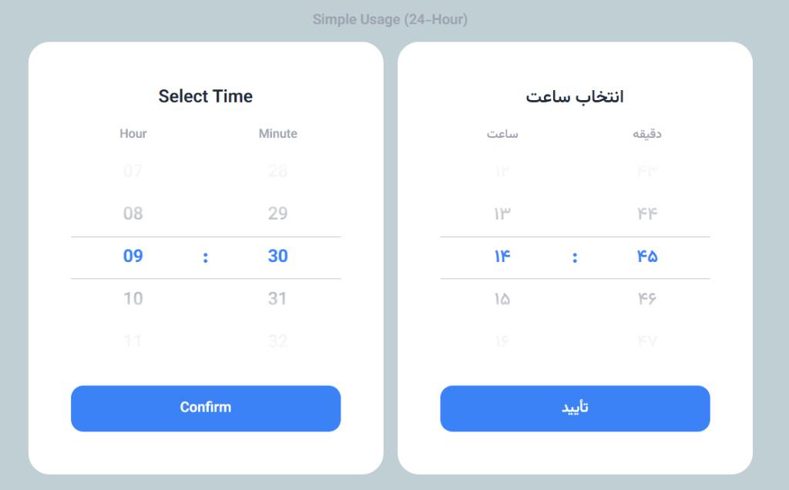
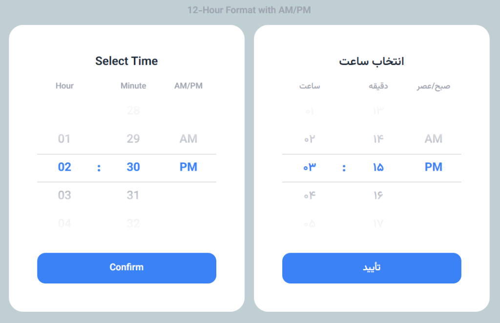
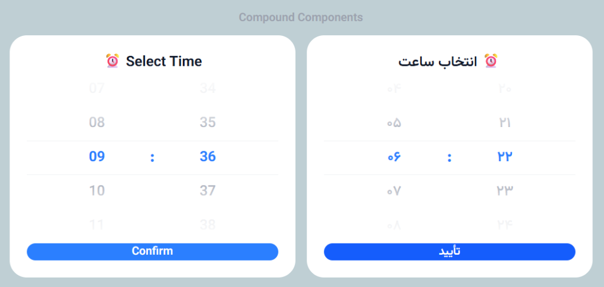

# react-ios-time-picker

A beautiful, accessible iOS-style time picker for React with **shadcn-style compound components**. Features smooth scroll-snap physics, 12-hour AM/PM support, touch/mouse drag, RTL support, and full TypeScript types.


## ✨ Features

- 🎡 **iOS-style scroll physics** - Native scroll-snap behavior
- 🧩 **Compound components** - Mix and match parts like shadcn/ui
- 🕐 **12-hour AM/PM support** - Built-in period wheel
- 🖱️ **Multi-input support** - Touch, mouse drag, and keyboard
- ♿ **Accessible** - ARIA listbox pattern with full keyboard support
- 🌐 **RTL & Persian numerals** - Built-in support for Persian/Arabic
- 🎨 **Fully customizable** - CSS classes, data attributes, or inline styles
- 📦 **Lightweight** - Zero dependencies, ~5KB gzipped
- 🔧 **TypeScript** - Complete type definitions included

## 📦 Installation

```bash
npm install @poursha98/react-ios-time-picker
```

## 🚀 Quick Start

### Simple Usage (All-in-One)



```tsx
import { useState } from "react";
import { TimePicker } from "@poursha98/react-ios-time-picker";
import "@poursha98/react-ios-time-picker/styles.css";

function App() {
  const [time, setTime] = useState("09:30");

  return (
    <TimePicker
      value={time}
      onChange={setTime}
      onConfirm={() => console.log("Selected:", time)}
    />
  );
}
```

### 12-Hour Format with AM/PM



```tsx
import { useState } from "react";
import { TimePicker } from "@poursha98/react-ios-time-picker";
import "@poursha98/react-ios-time-picker/styles.css";

function App() {
  const [time, setTime] = useState("02:30 PM");

  return <TimePicker value={time} onChange={setTime} is12Hour />;
}
```

### Compound Components (Full Control)



For maximum flexibility, use individual compound components:

```tsx
import { useState } from "react";
import {
  TimePickerRoot,
  TimePickerTitle,
  TimePickerWheels,
  TimePickerWheel,
  TimePickerSeparator,
  TimePickerButton,
} from "@poursha98/react-ios-time-picker";
import "@poursha98/react-ios-time-picker/styles.css";

function CustomTimePicker() {
  const [time, setTime] = useState("09:30");

  return (
    <TimePickerRoot
      value={time}
      onChange={setTime}
      className="bg-slate-900 rounded-2xl p-6"
    >
      <TimePickerTitle className="text-white text-xl font-bold mb-4">
        ⏰ Select Time
      </TimePickerTitle>

      <TimePickerWheels className="flex justify-center items-center gap-2">
        <TimePickerWheel type="hour" className="bg-slate-800 rounded-lg" />

        <TimePickerSeparator className="text-blue-400 text-2xl font-bold">
          :
        </TimePickerSeparator>

        <TimePickerWheel type="minute" className="bg-slate-800 rounded-lg" />
      </TimePickerWheels>

      <TimePickerButton className="mt-6 w-full bg-blue-500 text-white py-3 rounded-xl">
        Confirm Selection
      </TimePickerButton>
    </TimePickerRoot>
  );
}
```

### 12-Hour with Compound Components

```tsx
<TimePickerRoot value={time} onChange={setTime} is12Hour>
  <TimePickerWheels>
    <TimePickerWheel type="hour" />
    <TimePickerSeparator>:</TimePickerSeparator>
    <TimePickerWheel type="minute" />
    <TimePickerWheel type="period" /> {/* AM/PM wheel */}
  </TimePickerWheels>
  <TimePickerButton />
</TimePickerRoot>
```

### Low-Level Wheel (Custom Pickers)

Build completely custom pickers using the base `Wheel` component:

```tsx
import { useState } from "react";
import { Wheel } from "@poursha98/react-ios-time-picker";

const fruits = [
  "🍎 Apple",
  "🍊 Orange",
  "🍋 Lemon",
  "🍇 Grape",
  "🍓 Strawberry",
];

function FruitPicker() {
  const [selected, setSelected] = useState(0);

  return (
    <Wheel
      items={fruits}
      value={selected}
      onChange={setSelected}
      itemHeight={48}
      visibleCount={5}
    />
  );
}
```

## 📚 API Reference

### TimePicker Props (All-in-One)

| Prop                | Type                     | Default              | Description                               |
| ------------------- | ------------------------ | -------------------- | ----------------------------------------- |
| `value`             | `string`                 | **required**         | Time value (`"HH:MM"` or `"HH:MM AM/PM"`) |
| `onChange`          | `(time: string) => void` | **required**         | Called when time changes                  |
| `onConfirm`         | `() => void`             | -                    | Called when confirm button is clicked     |
| `is12Hour`          | `boolean`                | `false`              | Enable 12-hour format with AM/PM          |
| `numerals`          | `"en" \| "fa" \| "auto"` | `"auto"`             | Number format and text language           |
| `hours`             | `number[]`               | `[0-23]` or `[1-12]` | Custom hours array                        |
| `minutes`           | `number[]`               | `[0-59]`             | Custom minutes array                      |
| `minuteStep`        | `number`                 | -                    | Minute interval (5, 15, 30)               |
| `showTitle`         | `boolean`                | `true`               | Show title                                |
| `showLabels`        | `boolean`                | `true`               | Show hour/minute labels                   |
| `showConfirmButton` | `boolean`                | `true`               | Show confirm button                       |
| `itemHeight`        | `number`                 | `48`                 | Height of each wheel item                 |
| `visibleCount`      | `number`                 | `5`                  | Number of visible items                   |
| `disabled`          | `boolean`                | `false`              | Disable the picker                        |
| `className`         | `string`                 | -                    | Root element className                    |
| `classNames`        | `TimePickerClassNames`   | -                    | CSS class names (legacy)                  |
| `styles`            | `TimePickerStyles`       | -                    | Inline styles (legacy)                    |

### Compound Components

#### TimePickerRoot

The context provider that wraps all other components.

```tsx
<TimePickerRoot
  value={time}
  onChange={setTime}
  is12Hour={false}
  numerals="auto"
  disabled={false}
  onConfirm={() => {}}
  className="my-picker"
>
  {children}
</TimePickerRoot>
```

#### TimePickerTitle

Displays the picker title. Uses `<h2>` by default.

```tsx
<TimePickerTitle className="text-xl font-bold">Select Time</TimePickerTitle>;

{
  /* Use asChild for custom elements */
}
<TimePickerTitle asChild>
  <h1>Choose Time</h1>
</TimePickerTitle>;
```

#### TimePickerWheels

Container for the wheel columns.

```tsx
<TimePickerWheels className="flex gap-2">
  {/* wheels go here */}
</TimePickerWheels>
```

#### TimePickerWheel

Individual wheel for hour, minute, or period (AM/PM).

```tsx
<TimePickerWheel type="hour" className="w-20" />
<TimePickerWheel type="minute" className="w-20" />
<TimePickerWheel type="period" className="w-16" /> {/* AM/PM */}
```

#### TimePickerSeparator

The colon between wheels.

```tsx
<TimePickerSeparator className="text-blue-500">:</TimePickerSeparator>
```

#### TimePickerLabel

Labels for each wheel column.

```tsx
<TimePickerLabel type="hour">Hour</TimePickerLabel>
<TimePickerLabel type="minute">Minute</TimePickerLabel>
```

#### TimePickerButton

Confirm button that triggers `onConfirm`.

```tsx
<TimePickerButton className="bg-blue-500 text-white px-4 py-2 rounded">
  Confirm
</TimePickerButton>;

{
  /* Use asChild for custom elements */
}
<TimePickerButton asChild>
  <a href="/next">Continue</a>
</TimePickerButton>;
```

### Wheel Props

| Prop           | Type                                     | Default      | Description                   |
| -------------- | ---------------------------------------- | ------------ | ----------------------------- |
| `items`        | `T[]`                                    | **required** | Array of items to display     |
| `value`        | `number`                                 | **required** | Currently selected index      |
| `onChange`     | `(index: number) => void`                | **required** | Called when selection changes |
| `itemHeight`   | `number`                                 | `40`         | Height of each item in pixels |
| `visibleCount` | `number`                                 | `5`          | Number of visible items       |
| `width`        | `string \| number`                       | `"100%"`     | Width of the wheel            |
| `renderItem`   | `(item, index, isSelected) => ReactNode` | -            | Custom item renderer          |
| `disabled`     | `boolean`                                | `false`      | Disable the wheel             |
| `classNames`   | `WheelClassNames`                        | -            | CSS class names               |
| `styles`       | `WheelStyles`                            | -            | Inline styles                 |
| `aria-label`   | `string`                                 | -            | Accessible label              |
| `getItemLabel` | `(item, index) => string`                | -            | Accessible item labels        |

## 🎨 Styling

### CSS Variables

Customize colors using CSS variables:

```css
:root {
  --time-picker-bg: #ffffff;
  --time-picker-text: #1f2937;
  --time-picker-text-secondary: #9ca3af;
  --time-picker-primary: #3b82f6;
  --time-picker-primary-light: rgba(59, 130, 246, 0.1);
}

/* Dark mode */
.dark {
  --time-picker-bg: #1f2937;
  --time-picker-text: #f3f4f6;
  --time-picker-text-secondary: #9ca3af;
  --time-picker-primary: #60a5fa;
  --time-picker-primary-light: rgba(96, 165, 250, 0.1);
}
```

### Data Attribute Selectors

Style using data attributes for more specificity:

```css
/* Root */
[data-time-picker] {
  background: #1e293b;
}

/* Title */
[data-time-picker-title] {
  color: white;
}

/* Wheel items */
[data-wheel-item] {
  color: #94a3b8;
}

[data-wheel-item][data-selected] {
  color: #3b82f6;
  font-weight: bold;
}

/* Wheel indicator */
[data-wheel-indicator] {
  border-color: #3b82f6;
}
```

### Tailwind CSS Example

```tsx
<TimePickerRoot
  value={time}
  onChange={setTime}
  className="bg-slate-900 rounded-2xl p-6 shadow-xl"
>
  <TimePickerTitle className="text-white font-bold text-xl mb-4">
    Choose Time
  </TimePickerTitle>

  <TimePickerWheels className="flex justify-center gap-2">
    <TimePickerWheel type="hour" className="bg-slate-800 rounded-lg" />
    <TimePickerSeparator className="text-blue-400 text-2xl">
      :
    </TimePickerSeparator>
    <TimePickerWheel type="minute" className="bg-slate-800 rounded-lg" />
  </TimePickerWheels>

  <TimePickerButton className="mt-4 w-full bg-linear-to-r from-blue-500 to-purple-500 text-white py-3 rounded-xl hover:opacity-90 transition">
    Confirm
  </TimePickerButton>
</TimePickerRoot>
```

## 📝 Examples

### Persian/RTL Support

```tsx
<TimePicker
  value={time}
  onChange={setTime}
  numerals="fa" // Persian numerals + Persian text
/>
```

### Custom Minute Steps

```tsx
// 15-minute intervals
<TimePicker
  value={time}
  onChange={setTime}
  minuteStep={15}
/>

// Or custom array
<TimePicker
  value={time}
  onChange={setTime}
  minutes={[0, 15, 30, 45]}
/>
```

### React Hook Form Integration

```tsx
import { Controller, useForm } from "react-hook-form";
import { TimePicker } from "@poursha98/react-ios-time-picker";

function MyForm() {
  const { control, handleSubmit } = useForm({
    defaultValues: { appointmentTime: "09:00" },
  });

  return (
    <form onSubmit={handleSubmit((data) => console.log(data))}>
      <Controller
        name="appointmentTime"
        control={control}
        render={({ field }) => (
          <TimePicker
            value={field.value}
            onChange={field.onChange}
            showConfirmButton={false}
          />
        )}
      />
      <button type="submit">Book Appointment</button>
    </form>
  );
}
```

### Without Default Styles

Import only the components without any CSS:

```tsx
import {
  TimePickerRoot,
  TimePickerWheel,
  TimePickerButton,
} from "@poursha98/react-ios-time-picker";
// No CSS import!

function MinimalPicker() {
  const [time, setTime] = useState("09:30");

  return (
    <TimePickerRoot value={time} onChange={setTime}>
      <TimePickerWheel type="hour" />
      <span>:</span>
      <TimePickerWheel type="minute" />
      <TimePickerButton>OK</TimePickerButton>
    </TimePickerRoot>
  );
}
```

## ♿ Accessibility

- Full keyboard navigation: Arrow keys, Home, End, Page Up/Down
- ARIA `listbox` pattern with `option` roles
- Screen reader announcements via `aria-label` and `getItemLabel`
- Focus management and visible focus indicators
- Unique ARIA IDs for multiple instances

## 🌐 Browser Support

- Chrome, Edge, Safari, Firefox (latest 2 versions)
- iOS Safari 13+
- Android Chrome 80+

## 📄 License

MIT © Poursha98
